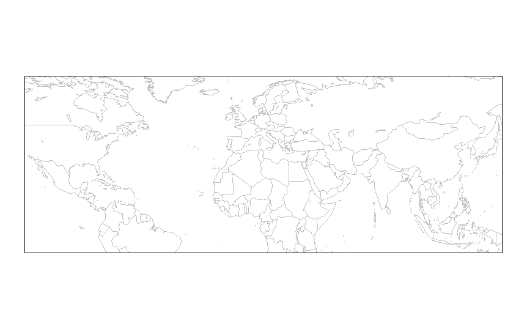
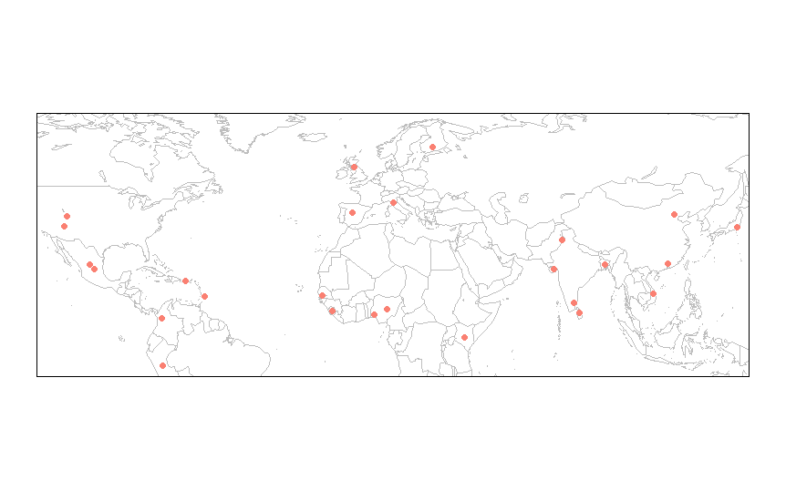
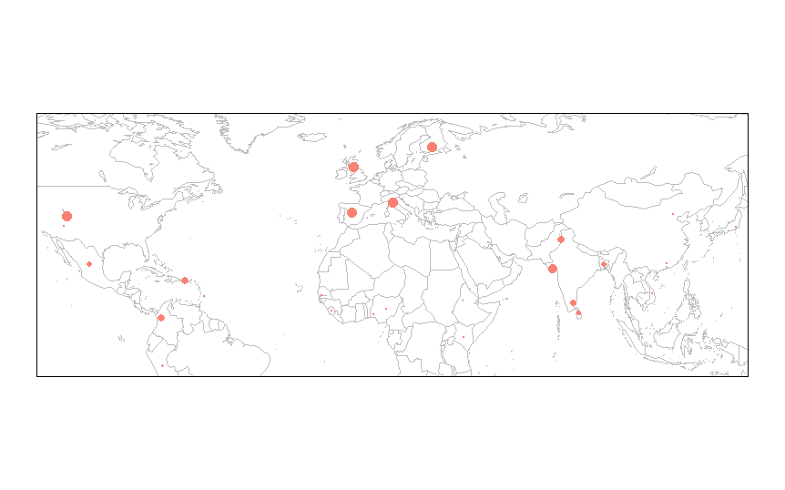
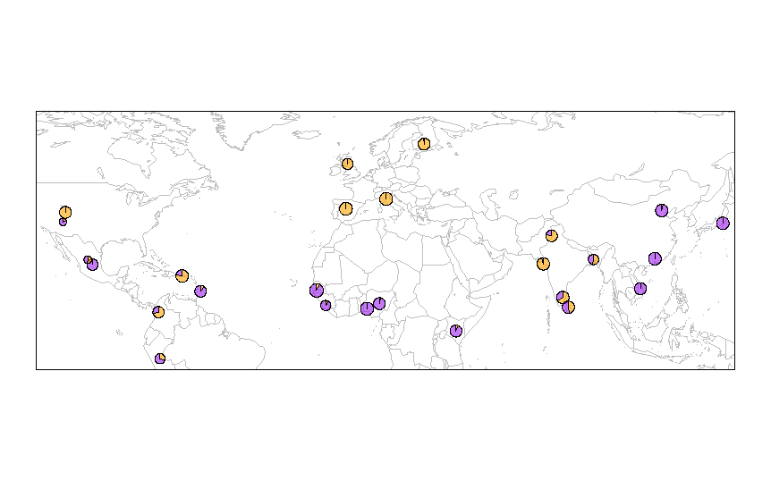
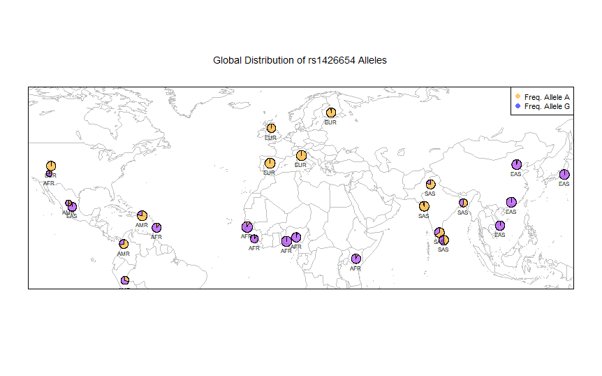

## 1. Importing Data

Import the allele frequency data using:
```r
	freq <- read.table("freq.df", header=TRUE)
```

Making sure that you are in the correct working directory.

## 2. Loading Map Packages

Load the packages we need to plot the data on a geographic map using:

```r
	library(maps)
	library(mapdata)
	library(scales)
	library(mapplots)
```

If you dont have the packages installed, use:

```r
	install.packages('maps')
```

And install all four before using the library command.

## 3. Drawing a World Map

From now on, use a text editor like Notepad++ to write your code, and just copy 
it into R Studio for ease of use.

Draw a world map using the command:
```r
	map('worldHires', xlim=c(-120,142), ylim=c(-12,72), col='gray', fill=FALSE)
	box()
```

It should look like this:
<center>
</img>
</center>

## Plotting the Populations on the Map

Using the command:

```r
	map('worldHires', xlim=c(-120,142), ylim=c(-12,72), col='gray', fill=FALSE)
	points(freq$long, freq$lat, pch=16, col="salmon")
	box()
```
We can plot the freq.df latitude and longitude on the world map, and get this:
<center>
</img>
</center>

We can vary the size of the dot depending on the population size adding the cex
variable to points:

```r
	map('worldHires', xlim=c(-120,142), ylim=c(-12,72), col='gray', fill=FALSE)
	points(freq$long, freq$lat, pch=16, cex=freq$Allele_A*1.5, col="salmon")
	box()
```

<center>
</img>
</center>

## Using Pie Charts to Show Population Size

These dots don't give us any info on the allele frequency, so we cant plot pi
charts instead of dots using the command:

```r
	map('worldHires', xlim=c(-120,142), ylim=c(-12,72), col='gray', fill=FALSE)
	add.pie(z=c(0.104, 0.895), x=-59.5412, y=13.1776, radius=192/100, 
            col=c(alpha("orange", 0.6), alpha("blue", 0.6)), labels="")
	box()
```

This will only plot one point however:
<center>
</img>
</center>

To plot all the points, we will need to use a For loop:

```r
	map("worldHires", xlim=c(-120,142), ylim=c(-12,72), col="grey", fill=FALSE)
	for (m in 1:26) {add.pie(z=c(freq$Allele_A[m], freq$Allele_G[m]), x=freq$long[m], y=freq$lat[m], radius=freq$N_CHR[m]/100, col=c(alpha("orange", 0.6), alpha("purple", 0.6)), labels="")
	m=m+1

	}
	box()
```

<center>
</img>
</center>

Now, we can add the legend and labels to the chart.

```r
	map("worldHires", xlim=c(-120,142), ylim=c(-12,72), col="grey", fill=FALSE)
	for (m in 1:26) {add.pie(z=c(freq$Allele_A[m], freq$Allele_G[m]), x=freq$long[m], y=freq$lat[m], radius=freq$N_CHR[m]/100, col=c(alpha("orange", 0.6), alpha("purple", 0.6)), labels="")
	m=m+1
	
	}

	text(freq$long, freq$lat, labels=freq$superpop, cex=0.5, pos=1)
	box()
	legend('topright', bty='1', c("Freq. Allele A", "Freq. Allele G"), 
        pch=16, col=c(alpha("orange", 0.6), alpha("blue", 0.6)), pt.cex=1, cex=0.7)
	title(main="Global Distribution of rs1426654 Alleles", font.main=1, cex.main=0.9)
```

<center>
</img>
</center>

To save the plot, we can use the pdf function.

```r
	pdf('WorldPie_Final2.pdf', width=10, height=7)
	
	map("worldHires", xlim=c(-120,142), ylim=c(-12,72), col="grey", fill=FALSE)
	for (m in 1:26) {add.pie(z=c(freq$Allele_A[m], freq$Allele_G[m]), x=freq$long[m], y=freq$lat[m], radius=freq$N_CHR[m]/100, col=c(alpha("orange", 0.6), alpha("purple", 0.6)), labels="")
	m=m+1
	
	}

	text(freq$long, freq$lat, labels=freq$superpop, cex=0.5, pos=1)
	box()
	legend('topright', bty='1', c("Freq. Allele A", "Freq. Allele G"), 
        pch=16, col=c(alpha("orange", 0.6), alpha("blue", 0.6)), pt.cex=1, cex=0.7)
	title(main="Global Distribution of rs1426654 Alleles", font.main=1, cex.main=0.9)
	
	dev.off()
```